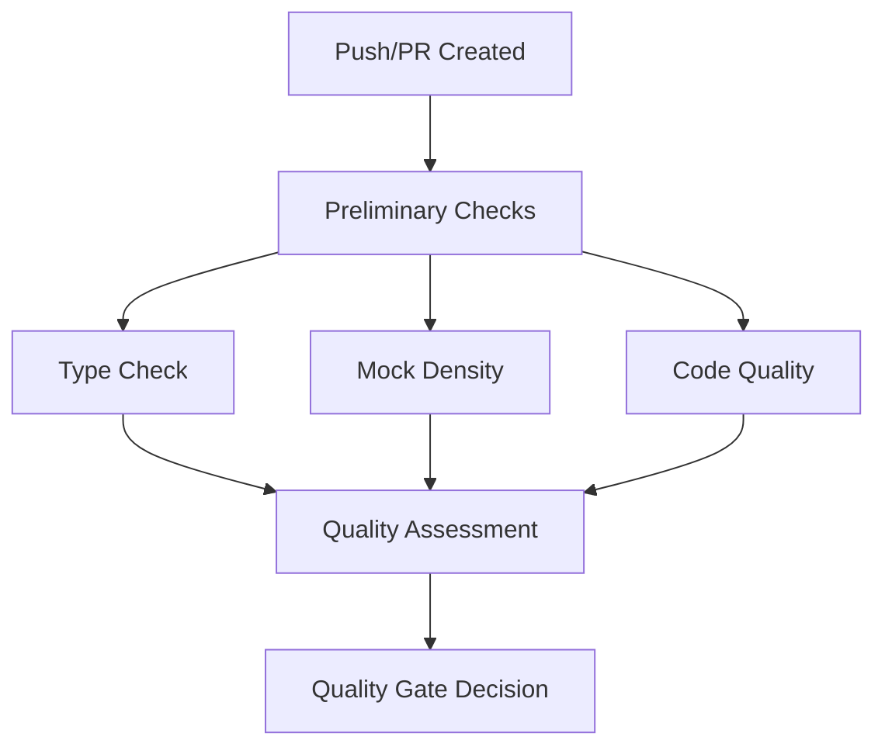

# CI/CD Quality Gates Documentation

This document provides comprehensive guidance on the SpritePal automated quality gate system, which enforces code quality standards through GitHub Actions workflows.

## Overview

The SpritePal quality gate system consists of multiple automated checks that ensure code quality, type safety, and maintainable test patterns. The system is designed to:

- **Prevent regressions** by catching issues before they reach main branches
- **Enforce standards** through configurable thresholds and automatic failure conditions  
- **Provide guidance** with actionable reports and improvement recommendations
- **Track progress** over time with trend analysis and historical data

## Workflow Architecture

### Primary Workflows

| Workflow | Purpose | Triggers | Timeout |
|----------|---------|----------|---------|
| `type-check.yml` | Type safety validation with basedpyright | Python file changes | 10 min |
| `mock-density.yml` | Test architecture quality monitoring | Test file changes | 5 min |
| `quality-gate.yml` | Master workflow coordinating all checks | All changes | 15 min |

### Workflow Dependencies



## Type Checking Gate (`type-check.yml`)

### Purpose
Validates type safety using basedpyright and enforces error thresholds to prevent type-related bugs.

### Thresholds
- **Critical Errors**: Maximum 20 (blocks merge)
- **Total Errors**: Maximum 150 (blocks merge)
- **Error Categories**:
  - Critical: `reportGeneralTypeIssues`, `reportArgumentType`, `reportAssignmentType`, etc.
  - Important: `reportReturnType`, `reportIndexIssue`, etc.
  - Low Priority: Style and convention issues

### Configuration
Type checking behavior is configured in `basedpyrightconfig.json`:

```json
{
  "typeCheckingMode": "basic",
  "reportOptionalMemberAccess": "error",
  "reportOptionalSubscript": "error",
  "reportAttributeAccessIssue": "error",
  "venv": "venv"
}
```

### Outputs
- **Artifacts**: `type-check-results/` containing JSON reports and coverage analysis
- **PR Comments**: Automatic type checking summary with error examples
- **GitHub Annotations**: File-specific error annotations in the PR diff

### Troubleshooting

#### Common Issues
1. **"basedpyright not found"**
   - Ensure `requirements.txt` includes `basedpyright>=1.1.0`
   - Check virtual environment activation

2. **"Threshold exceeded" when errors seem minor**
   - Critical errors are weighted heavily for safety
   - Focus on fixing `reportArgumentType` and `reportAssignmentType` first

3. **Inconsistent results between local and CI**
   - Verify same Python version (3.12)
   - Check for differences in installed dependencies

#### Override Instructions
To temporarily bypass type checking (emergency use only):

```yaml
# Add to workflow file temporarily
- name: Override type check
  if: contains(github.event.head_commit.message, '[skip-typecheck]')
  run: echo "Type checking skipped"
```

## Mock Density Gate (`mock-density.yml`)

### Purpose
Monitors test architecture quality by analyzing mock usage patterns and identifying problematic test designs.

### Thresholds
- **New Files**: Maximum 0.02 density (2 mocks per 100 lines) - **BLOCKS MERGE**
- **Existing Files**: Maximum 0.01 density (1 mock per 100 lines) - **WARNING ONLY**

### What It Analyzes
- Mock function calls (`Mock()`, `patch()`, `MagicMock()`, etc.)
- Import statements from mock libraries
- Deprecated `MockFactory` usage patterns
- Test method density (mocks per test method)

### Density Calculation
```python
density = mock_calls / total_lines_in_file
```

### Migration Guidance
The system specifically detects and reports deprecated patterns:

```python
# 🔴 Deprecated (high density)
from tests.infrastructure.mock_factory import MockFactory

def test_example():
    mock_manager = MockFactory.create_extraction_manager()
    mock_window = MockFactory.create_main_window()

# ✅ Recommended (low density)  
from tests.infrastructure.real_component_factory import RealComponentFactory

def test_example():
    manager = RealComponentFactory.create_extraction_manager()
    window = RealComponentFactory.create_main_window()
```

### Override Instructions
For legitimate high-mock-density cases:

```python
# Add comment to test file
# mock-density: ignore - complex integration test requiring extensive mocking
```

## Quality Gate Master (`quality-gate.yml`)

### Purpose
Orchestrates all quality checks and makes final pass/fail decisions based on comprehensive analysis.

### Quality Scoring System

The system calculates a weighted quality score (0-100):

- **Type Safety (40%)**: Based on error counts and severity
- **Test Quality (30%)**: Based on mock density and patterns  
- **Code Quality (20%)**: Based on linting results
- **Maintainability (10%)**: Based on error distribution

### Grade Scale
| Score | Grade | Status | Action |
|-------|-------|--------|--------|
| 95-100 | A+ | Excellent | Merge approved |
| 90-94 | A | Excellent | Merge approved |
| 85-89 | A- | Very Good | Merge approved |
| 80-84 | B+ | Good | Merge approved |
| 75-79 | B | Good | Merge approved |
| 70-74 | B- | Acceptable | Merge approved |
| 65-69 | C+ | Needs Work | Review required |
| 60-64 | C | Poor | Improvements needed |
| < 60 | D/F | Failing | **Merge blocked** |

### Failure Conditions
The quality gate **BLOCKS MERGE** if:
- Critical type errors > 20
- Total type errors > 150  
- Overall quality score < 70
- Code quality checks fail (linting errors)

Mock density violations generate **WARNINGS** but don't block merges.

### PR Comments
The master workflow posts comprehensive reports including:
- Overall quality grade and score
- Specific error counts and examples
- Areas for improvement with prioritization
- Migration recommendations for deprecated patterns

## Supporting Scripts

### `scripts/check_type_errors.py`

Enhanced type checking analyzer with CI/CD focus:

```bash
# Basic usage
python scripts/check_type_errors.py \
  --threshold-critical 20 \
  --threshold-total 150 \
  --github-actions

# Custom thresholds
python scripts/check_type_errors.py \
  --threshold-critical 10 \
  --threshold-total 100 \
  --output type-report.json

# Analyze specific files
python scripts/check_type_errors.py core/ ui/ --github-actions
```

**Key Features**:
- JSON output parsing from basedpyright
- Error categorization by severity
- GitHub Actions formatted output
- Threshold enforcement with exit codes

### `scripts/generate_quality_report.py`

Comprehensive quality report generator:

```bash
# Generate markdown report
python scripts/generate_quality_report.py \
  --type-check results/type-check.json \
  --mock-density results/mock-density.json \
  --format markdown \
  --output quality-report.md

# Generate JSON with raw data
python scripts/generate_quality_report.py \
  --type-check results/type-check.json \
  --mock-density results/mock-density.json \
  --format json \
  --include-raw-data \
  --threshold 75
```

**Key Features**:
- Multi-source data aggregation
- Weighted scoring algorithm
- Trend analysis capabilities
- Markdown and JSON output formats

## Configuration Reference

### Threshold Configuration

Default thresholds can be modified in workflow files:

```yaml
# .github/workflows/type-check.yml
- name: Run type checking
  run: |
    python scripts/check_type_errors.py \
      --threshold-critical 15 \    # Lower for stricter enforcement
      --threshold-total 100 \      # Lower for stricter enforcement
      --github-actions
```

```yaml
# .github/workflows/mock-density.yml
- name: Analyze mock density
  run: |
    python scripts/check_mock_density.py \
      --threshold-new 0.015 \      # Lower for stricter enforcement  
      --threshold-existing 0.008 \ # Lower for stricter enforcement
      --github-actions
```

### Quality Score Weights

Modify in `scripts/generate_quality_report.py`:

```python
# Current weights
overall = (
    type_score * 0.4 +      # Type safety emphasis
    test_score * 0.3 +      # Test quality important  
    code_score * 0.2 +      # Code quality standard
    maintainability * 0.1   # Maintainability baseline
)
```

## Monitoring and Maintenance

### Artifact Storage
All workflows store results as GitHub Actions artifacts:
- **Retention**: 30 days
- **Contents**: JSON reports, logs, analysis data
- **Access**: Available through GitHub Actions UI

### Trend Analysis
The system tracks quality metrics over time:
- Error count progression
- Mock density trends  
- Quality score history
- File-specific improvements

### Alert Conditions
Monitor these indicators for system health:
- Consistently failing quality gates (> 50% failure rate)
- Increasing error thresholds needed
- High mock density in new code
- Workflow timeout increases

## Migration and Updates

### Updating Thresholds
When code quality improves systematically:

1. **Analyze current performance** with historical data
2. **Gradually lower thresholds** by 10-20% increments  
3. **Monitor failure rates** and adjust accordingly
4. **Communicate changes** to development team

### Adding New Checks
To add additional quality checks:

1. **Create focused workflow** for specific check type
2. **Add to quality-gate.yml** as dependency
3. **Update generate_quality_report.py** with new metrics
4. **Test thoroughly** in feature branch first

### Handling Legacy Code
For files with high error counts:
- Consider separate thresholds for legacy vs new code
- Implement gradual improvement targets
- Use file-specific exclusions sparingly

## Emergency Procedures

### Bypassing Quality Gates
For critical hotfixes only:

```bash
# Add to commit message
git commit -m "Critical security fix [skip-ci]"

# Or use workflow-specific skips  
git commit -m "Fix broken build [skip-typecheck]"
```

### Temporarily Raising Thresholds
Edit workflow files directly:

```yaml
--threshold-critical 50 \    # Temporary increase
--threshold-total 300 \      # Temporary increase  
```

**Important**: Revert threshold changes after fixing underlying issues.

### Workflow Failures
If workflows themselves fail:
1. Check GitHub Actions status page
2. Verify runner availability  
3. Check for dependency installation issues
4. Review workflow logs for specific errors

## Best Practices

### For Developers
- **Run checks locally** before pushing: `python scripts/check_type_errors.py`
- **Focus on critical errors** first - they have the biggest impact
- **Migrate away from MockFactory** when touching test files
- **Add type hints** to new code to prevent future errors

### For Maintainers  
- **Monitor threshold effectiveness** - adjust gradually as quality improves
- **Review quality trends** monthly to identify patterns
- **Keep documentation updated** when changing thresholds or adding checks
- **Communicate changes** to team before implementation

### For Emergency Situations
- **Use skip flags judiciously** - document why in commit messages
- **Create follow-up issues** to address bypassed checks
- **Prefer temporary threshold increases** over complete bypasses
- **Review emergency bypasses** in post-incident reviews

## Troubleshooting Guide

### Common Error Messages

#### "Type checking failed with exit code 1"
**Cause**: Type errors exceed thresholds
**Solution**: 
1. Run `python scripts/check_type_errors.py --critical` locally
2. Fix critical errors first (highest impact)
3. Add type hints to untyped functions

#### "Mock density check failed"
**Cause**: New test files have too many mocks
**Solution**:
1. Review mock usage in failing files
2. Consider using RealComponentFactory instead
3. Split complex tests into smaller, focused tests

#### "Quality gate decision failed"
**Cause**: Overall quality score below 70
**Solution**:
1. Check individual component scores in PR comments
2. Address highest-weighted issues first (type safety)
3. Consider temporary threshold adjustment if justified

### Performance Issues

#### Workflow timeouts
- **Type checking > 10 min**: Consider excluding large generated files
- **Mock analysis > 5 min**: Check for infinite loops in analysis
- **Overall gate > 15 min**: May need to optimize parallel execution

#### High resource usage
- Cache pip dependencies to reduce installation time
- Use smaller runner types for lightweight checks
- Consider conditional execution for unchanged components

## Future Enhancements

### Planned Features
- **Code coverage integration** with quality scoring
- **Security scanning** as additional quality dimension  
- **Performance regression detection** in quality gates
- **ML-based error priority prediction** for better threshold tuning

### Integration Opportunities
- **IDE plugins** for real-time quality feedback
- **Pre-commit hooks** for early error detection
- **Release automation** based on quality gates
- **Slack/Teams notifications** for quality trends

---

*This documentation is maintained alongside the quality gate system. For questions or suggestions, please create an issue in the repository.*